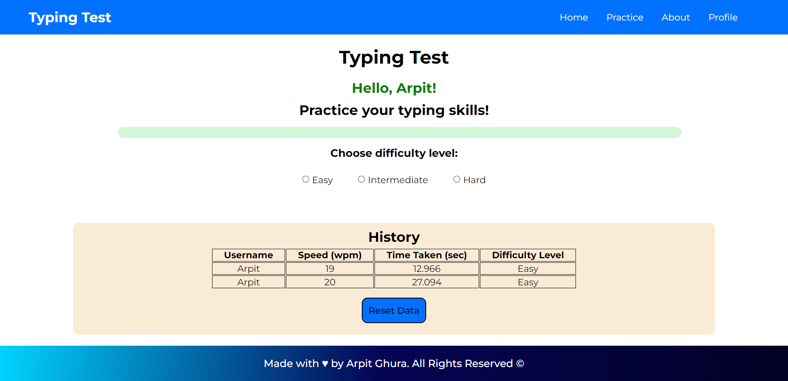
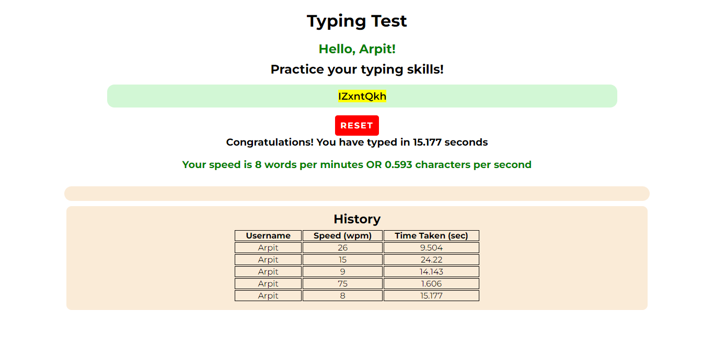

#  Typing Test - Practice Your Typing Skills

Typing Test is a webapp to test and practice your typing skills in order to enhance them. In the App, words and sentences are generated randomly to ensure no repetition of a word or a sentence.

The Web App can be accessible from [https://typing-test-project.vercel.app/](https://typing-test-project.vercel.app/)  

## Features 
<ul>
    <li>Time Based Test and Practice Sessions</li>
    <li>Paragraph Based Test and Practice Sessions</li>
    <li>Change Difficulty Level as per your choice</li>
    <li>History Saver with Username</li>
</ul>

## Tech Stack : 

1. HTML5

2. CSS3

3. JavaScript

> Test your Typing skills NOW!

## Practice in the web app smoothly

Practice Page:

Report Generated on Completion:

### Contributors

<table>
<tr>
    <td align="center" style="word-wrap: break-word; width: 150.0; height: 150.0">
        <a href=https://github.com/arpitghura>
            
             
            <b>Arpit Ghura</b>
        </a>
    </td>
    <td align="center" style="word-wrap: break-word; width: 150.0; height: 150.0">
        <a href=https://github.com/Giriraj-Roy>
            
             
            <b>Giriraj Roy</b>
        </a>
    </td>
    <td align="center" style="word-wrap: break-word; width: 150.0; height: 150.0">
        <a href=https://github.com/iharshka>
            
             
            <b>Harsh Gautam</b>
        </a>
    </td>
    <td align="center" style="word-wrap: break-word; width: 150.0; height: 150.0">
        <a href=https://github.com/sibayanmisra2002>
            
             
            <b>Sibayan Misra</b>
        </a>
    </td>
    <td align="center" style="word-wrap: break-word; width: 150.0; height: 150.0">
        <a href=https://github.com/mdhinesh>
            
             
            <b>Dhinesh M</b>
        </a>
    </td>
    <td align="center" style="word-wrap: break-word; width: 150.0; height: 150.0">
        <a href=https://github.com/maciek04786>
            
             
            <b>Maciek S</b>
        </a>
    </td>
</tr>
<tr>
    <td align="center" style="word-wrap: break-word; width: 150.0; height: 150.0">
        <a href=https://github.com/imThiyagu>
            
             
            <b>Thiyagarajan Ravichandran</b>
        </a>
    </td>
    <td align="center" style="word-wrap: break-word; width: 150.0; height: 150.0">
        <a href=https://github.com/dissyulina>
            
             
            <b>Dissy Ulina</b>
        </a>
    </td>
    <td align="center" style="word-wrap: break-word; width: 150.0; height: 150.0">
        <a href=https://github.com/emday4prez>
            
             
            <b>Emerson</b>
        </a>
    </td>
    <td align="center" style="word-wrap: break-word; width: 150.0; height: 150.0">
        <a href=https://github.com/ImgBotApp>
            
             
            <b>Imgbot</b>
        </a>
    </td>
    <td align="center" style="word-wrap: break-word; width: 150.0; height: 150.0">
        <a href=https://github.com/priyanshu2k3>
            
             
            <b>Priyanshu</b>
        </a>
    </td>
    <td align="center" style="word-wrap: break-word; width: 150.0; height: 150.0">
        <a href=https://github.com/SubhamChoudhury>
            
             
            <b>Subham Choudhury</b>
        </a>
    </td>
</tr>
<tr>
    <td align="center" style="word-wrap: break-word; width: 150.0; height: 150.0">
        <a href=https://github.com/V35HR4J>
            
             
            <b>Veshraj Ghimire</b>
        </a>
    </td>
</tr>
</table>

Thanks for coming here!
### Give a star if you liked this!
