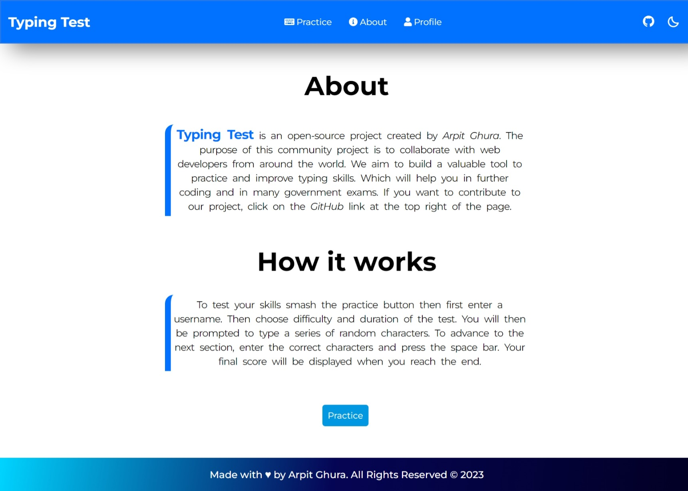
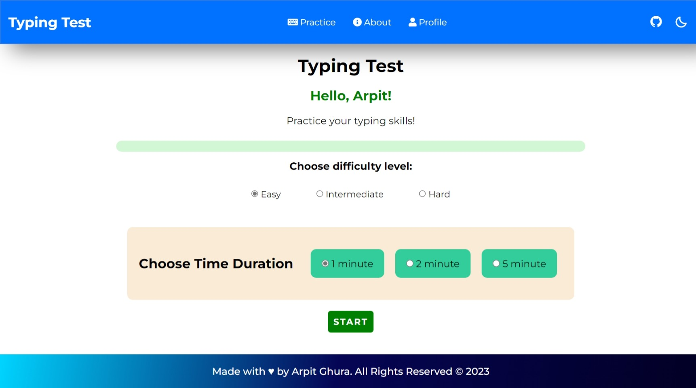
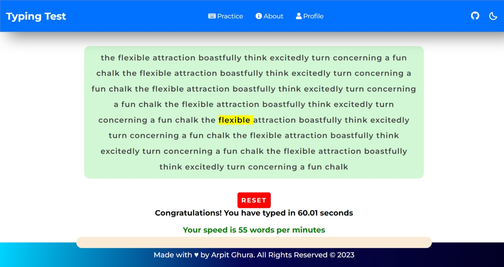
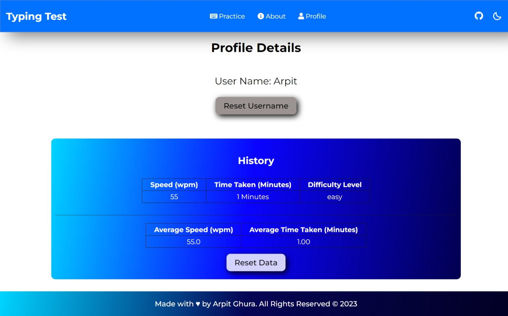
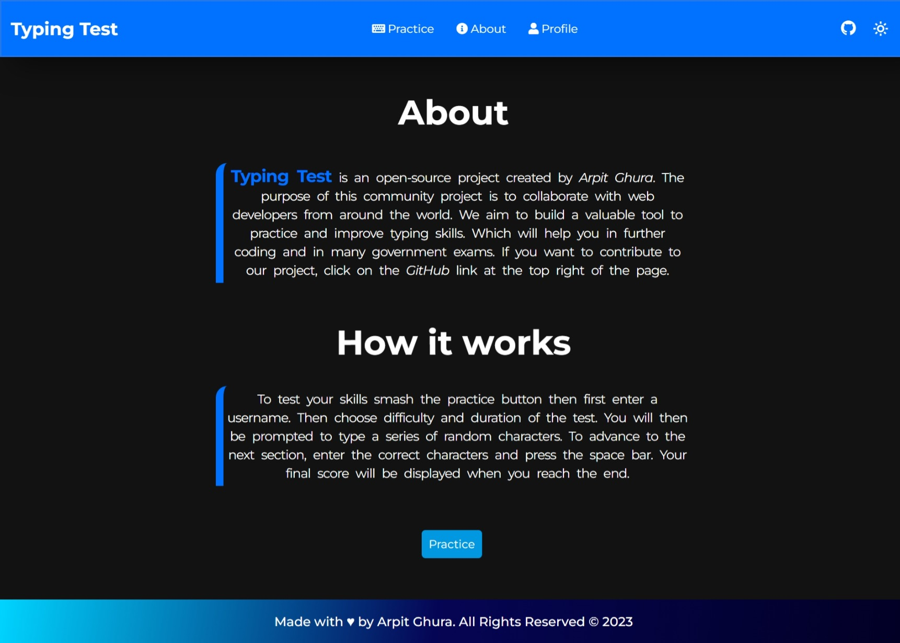

#  Typing Test - Practice Your Typing Skills

          

Typing Test is a web app to test and practice your typing skills. Users can practice and improve their typing speed by practicing multiple times. The App generates a set of words (real words that we use in daily life) to practice so that the user will be able to type all types of words. Also, the App stores the session history of all the practice sessions the user takes, along with the time taken to complete the practice session and the efficiency (words per minute). The user has the functionality to reset all the stored values. 

The Web App can be accessible from [https://typing-test-project.vercel.app](https://typing-test-project.vercel.app)

### Project Domain: Web 
### Tech Stack : 

1. HTML5

2. CSS3

3. JavaScript

> Test your Typing skills NOW!

## Practice in the web app smoothly

About Page:

Practice Page:

Session Completion Message:

Report Generated on Completion:

Dark theme:

---
## Contributors    Thanks to all the contributors for their efforts 💖

<table>
<tr>
    <td align="center" style="word-wrap: break-word; width: 150.0; height: 150.0">
        <a href=https://github.com/arpitghura>
            
             
            <b>Arpit Ghura</b>
        </a>
    </td>
    <td align="center" style="word-wrap: break-word; width: 150.0; height: 150.0">
        <a href=https://github.com/aviiciii>
            
             
            <b>aviiciii</b>
        </a>
    </td>
    <td align="center" style="word-wrap: break-word; width: 150.0; height: 150.0">
        <a href=https://github.com/A91y>
            
             
            <b>Ayush Agrawal</b>
        </a>
    </td>
    <td align="center" style="word-wrap: break-word; width: 150.0; height: 150.0">
        <a href=https://github.com/shreyash-b>
            
             
            <b>Shreyash</b>
        </a>
    </td>
    <td align="center" style="word-wrap: break-word; width: 150.0; height: 150.0">
        <a href=https://github.com/Shantanu-Meta>
            
             
            <b>Shantanu Dutta</b>
        </a>
    </td>
    <td align="center" style="word-wrap: break-word; width: 150.0; height: 150.0">
        <a href=https://github.com/Jideotetic>
            
             
            <b>Abdulbasit Yusuf </b>
        </a>
    </td>
</tr>
<tr>
    <td align="center" style="word-wrap: break-word; width: 150.0; height: 150.0">
        <a href=https://github.com/Giriraj-Roy>
            
             
            <b>Giriraj Roy</b>
        </a>
    </td>
    <td align="center" style="word-wrap: break-word; width: 150.0; height: 150.0">
        <a href=https://github.com/niladrix719>
            
             
            <b>Niladri Adhikary</b>
        </a>
    </td>
    <td align="center" style="word-wrap: break-word; width: 150.0; height: 150.0">
        <a href=https://github.com/chikkibum>
            
             
            <b>Bhaskar Pandey</b>
        </a>
    </td>
    <td align="center" style="word-wrap: break-word; width: 150.0; height: 150.0">
        <a href=https://github.com/alexsam29>
            
             
            <b>Alexander Samaniego</b>
        </a>
    </td>
    <td align="center" style="word-wrap: break-word; width: 150.0; height: 150.0">
        <a href=https://github.com/Riya14-dangra>
            
             
            <b>Riya Dangra</b>
        </a>
    </td>
    <td align="center" style="word-wrap: break-word; width: 150.0; height: 150.0">
        <a href=https://github.com/ImgBotApp>
            
             
            <b>Imgbot</b>
        </a>
    </td>
</tr>
<tr>
    <td align="center" style="word-wrap: break-word; width: 150.0; height: 150.0">
        <a href=https://github.com/weberankit>
            
             
            <b>ANKIT KUMAR</b>
        </a>
    </td>
    <td align="center" style="word-wrap: break-word; width: 150.0; height: 150.0">
        <a href=https://github.com/iharshka>
            
             
            <b>Harsh Gautam</b>
        </a>
    </td>
    <td align="center" style="word-wrap: break-word; width: 150.0; height: 150.0">
        <a href=https://github.com/sibayanmisra2002>
            
             
            <b>Sibayan Misra</b>
        </a>
    </td>
    <td align="center" style="word-wrap: break-word; width: 150.0; height: 150.0">
        <a href=https://github.com/sethiamit0079>
            
             
            <b>Amit Sethi</b>
        </a>
    </td>
    <td align="center" style="word-wrap: break-word; width: 150.0; height: 150.0">
        <a href=https://github.com/mdhinesh>
            
             
            <b>Dhinesh M</b>
        </a>
    </td>
    <td align="center" style="word-wrap: break-word; width: 150.0; height: 150.0">
        <a href=https://github.com/zemetskiym>
            
             
            <b>zemetskiym</b>
        </a>
    </td>
</tr>
<tr>
    <td align="center" style="word-wrap: break-word; width: 150.0; height: 150.0">
        <a href=https://github.com/ihsingh2>
            
             
            <b>Himanshu Singh</b>
        </a>
    </td>
    <td align="center" style="word-wrap: break-word; width: 150.0; height: 150.0">
        <a href=https://github.com/Tapo41>
            
             
            <b>Tapojita Kar</b>
        </a>
    </td>
    <td align="center" style="word-wrap: break-word; width: 150.0; height: 150.0">
        <a href=https://github.com/Pritam1136>
            
             
            <b>Pritam Roy</b>
        </a>
    </td>
    <td align="center" style="word-wrap: break-word; width: 150.0; height: 150.0">
        <a href=https://github.com/kalosFestus>
            
             
            <b>Festus Adeyemi</b>
        </a>
    </td>
    <td align="center" style="word-wrap: break-word; width: 150.0; height: 150.0">
        <a href=https://github.com/TheXro>
            
             
            <b>Ravi Yadav</b>
        </a>
    </td>
    <td align="center" style="word-wrap: break-word; width: 150.0; height: 150.0">
        <a href=https://github.com/Ayush4web>
            
             
            <b>Ayush Choubey</b>
        </a>
    </td>
</tr>
<tr>
    <td align="center" style="word-wrap: break-word; width: 150.0; height: 150.0">
        <a href=https://github.com/sarthakvermaa>
            
             
            <b>Sarthak Verma</b>
        </a>
    </td>
    <td align="center" style="word-wrap: break-word; width: 150.0; height: 150.0">
        <a href=https://github.com/mallickboy>
            
             
            <b>TAMAL MALLICK</b>
        </a>
    </td>
    <td align="center" style="word-wrap: break-word; width: 150.0; height: 150.0">
        <a href=https://github.com/ananyakushal>
            
             
            <b>A_Kushal</b>
        </a>
    </td>
    <td align="center" style="word-wrap: break-word; width: 150.0; height: 150.0">
        <a href=https://github.com/trravic>
            
             
            <b>Thiyagarajan Ravichandran</b>
        </a>
    </td>
    <td align="center" style="word-wrap: break-word; width: 150.0; height: 150.0">
        <a href=https://github.com/Nupoor10>
            
             
            <b>Nupoor Shetye</b>
        </a>
    </td>
    <td align="center" style="word-wrap: break-word; width: 150.0; height: 150.0">
        <a href=https://github.com/maciek04786>
            
             
            <b>Maciek S</b>
        </a>
    </td>
</tr>
<tr>
    <td align="center" style="word-wrap: break-word; width: 150.0; height: 150.0">
        <a href=https://github.com/harshyadavcs>
            
             
            <b>Harsh Yadav</b>
        </a>
    </td>
    <td align="center" style="word-wrap: break-word; width: 150.0; height: 150.0">
        <a href=https://github.com/ajayanuragi>
            
             
            <b>Ajay Anuragi</b>
        </a>
    </td>
    <td align="center" style="word-wrap: break-word; width: 150.0; height: 150.0">
        <a href=https://github.com/dissyulina>
            
             
            <b>Dissy Ulina</b>
        </a>
    </td>
    <td align="center" style="word-wrap: break-word; width: 150.0; height: 150.0">
        <a href=https://github.com/emday4prez>
            
             
            <b>Emerson</b>
        </a>
    </td>
    <td align="center" style="word-wrap: break-word; width: 150.0; height: 150.0">
        <a href=https://github.com/priyanshu2k3>
            
             
            <b>PRIYANSHU PRASAD GUPTA</b>
        </a>
    </td>
    <td align="center" style="word-wrap: break-word; width: 150.0; height: 150.0">
        <a href=https://github.com/ShivanshAr97>
            
             
            <b>Shivansh Arora</b>
        </a>
    </td>
</tr>
<tr>
    <td align="center" style="word-wrap: break-word; width: 150.0; height: 150.0">
        <a href=https://github.com/SubhamChoudhury>
            
             
            <b>Subham Choudhury</b>
        </a>
    </td>
    <td align="center" style="word-wrap: break-word; width: 150.0; height: 150.0">
        <a href=https://github.com/V35HR4J>
            
             
            <b>Veshraj Ghimire</b>
        </a>
    </td>
    <td align="center" style="word-wrap: break-word; width: 150.0; height: 150.0">
        <a href=https://github.com/alokvns48>
            
             
            <b>Alok Pandey</b>
        </a>
    </td>
</tr>
</table>

## Open-source Event 
1. Code Peak'23
2. Diversion 2K23
3. InnoGeeks Winter of Code'23
4. Kharagpur Winter of Code'22
5. HacktoberFest 2022

Thanks for coming here!
### Give a ⭐ if you liked this!
