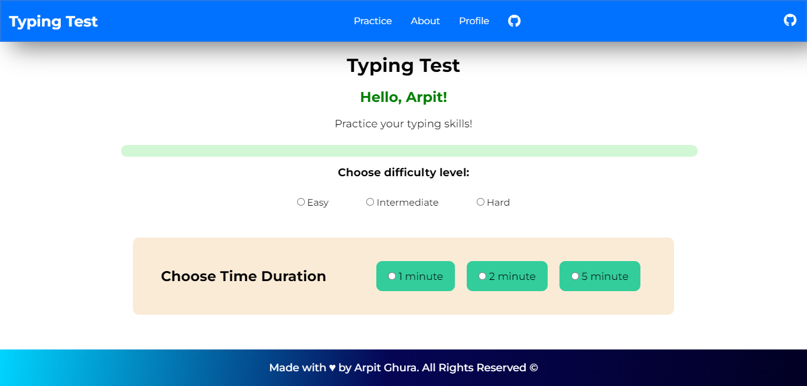
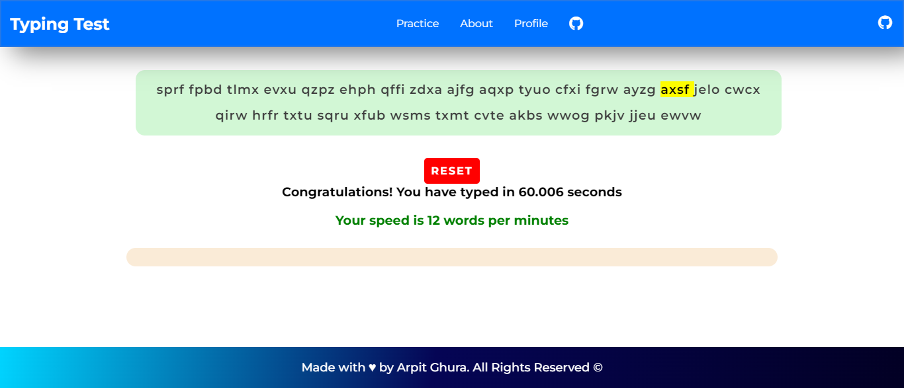
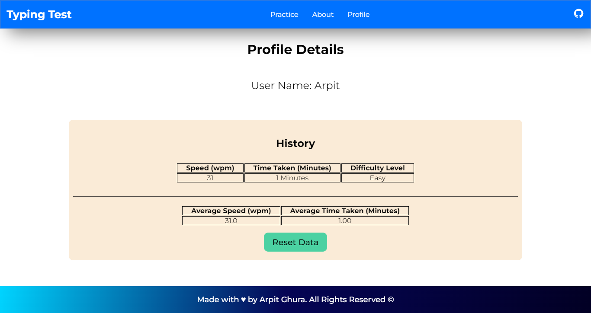

#  Typing Test - Practice Your Typing Skills

          

Typing Test is a webapp to test and practice your typing skills in order to enhance them. In the App, words and sentences are generated randomly to ensure no repetition of a word or a sentence. 

The Web App can be accessible from [https://typing-test-project.vercel.app](https://typing-test-project.vercel.app)

## Part of Diversion 2k23 Open-source Event 

    

### [Click to Know More about Contributing through Diversion 2k23](diversion-2k23.md)
 

### Project Domain: Web 
### Tech Stack : 

1. HTML5

2. CSS3

3. JavaScript

> Test your Typing skills NOW!

## Practice in the web app smoothly

Practice Page:

Session Completion Message:

Report Generated on Completion:

---
## Contributors    Thanks to all the contributors for their efforts 💖

<table>
<tr>
    <td align="center" style="word-wrap: break-word; width: 150.0; height: 150.0">
        <a href=https://github.com/arpitghura>
            
             
            <b>Arpit Ghura</b>
        </a>
    </td>
    <td align="center" style="word-wrap: break-word; width: 150.0; height: 150.0">
        <a href=https://github.com/aviiciii>
            
             
            <b>Laaveshwaran Parthiban</b>
        </a>
    </td>
    <td align="center" style="word-wrap: break-word; width: 150.0; height: 150.0">
        <a href=https://github.com/A91y>
            
             
            <b>Ayush Agrawal</b>
        </a>
    </td>
    <td align="center" style="word-wrap: break-word; width: 150.0; height: 150.0">
        <a href=https://github.com/shreyash-b>
            
             
            <b>Shreyash</b>
        </a>
    </td>
    <td align="center" style="word-wrap: break-word; width: 150.0; height: 150.0">
        <a href=https://github.com/Shantanu-Meta>
            
             
            <b>Shantanu Dutta</b>
        </a>
    </td>
    <td align="center" style="word-wrap: break-word; width: 150.0; height: 150.0">
        <a href=https://github.com/Jideotetic>
            
             
            <b>Yusuf Abdulbasit</b>
        </a>
    </td>
</tr>
<tr>
    <td align="center" style="word-wrap: break-word; width: 150.0; height: 150.0">
        <a href=https://github.com/niladrix719>
            
             
            <b>Niladri Adhikary </b>
        </a>
    </td>
    <td align="center" style="word-wrap: break-word; width: 150.0; height: 150.0">
        <a href=https://github.com/Giriraj-Roy>
            
             
            <b>Giriraj Roy</b>
        </a>
    </td>
    <td align="center" style="word-wrap: break-word; width: 150.0; height: 150.0">
        <a href=https://github.com/ImgBotApp>
            
             
            <b>Imgbot</b>
        </a>
    </td>
    <td align="center" style="word-wrap: break-word; width: 150.0; height: 150.0">
        <a href=https://github.com/Riya14-dangra>
            
             
            <b>Riya Dangra</b>
        </a>
    </td>
    <td align="center" style="word-wrap: break-word; width: 150.0; height: 150.0">
        <a href=https://github.com/alexsam29>
            
             
            <b>Alexander Samaniego</b>
        </a>
    </td>
    <td align="center" style="word-wrap: break-word; width: 150.0; height: 150.0">
        <a href=https://github.com/chikkibum>
            
             
            <b>Bhaskar Pandey</b>
        </a>
    </td>
</tr>
<tr>
    <td align="center" style="word-wrap: break-word; width: 150.0; height: 150.0">
        <a href=https://github.com/iharshka>
            
             
            <b>Harsh Gautam</b>
        </a>
    </td>
    <td align="center" style="word-wrap: break-word; width: 150.0; height: 150.0">
        <a href=https://github.com/sibayanmisra2002>
            
             
            <b>Sibayan Misra</b>
        </a>
    </td>
    <td align="center" style="word-wrap: break-word; width: 150.0; height: 150.0">
        <a href=https://github.com/amitsethii>
            
             
            <b>amitsethii</b>
        </a>
    </td>
    <td align="center" style="word-wrap: break-word; width: 150.0; height: 150.0">
        <a href=https://github.com/mdhinesh>
            
             
            <b>Dhinesh M</b>
        </a>
    </td>
    <td align="center" style="word-wrap: break-word; width: 150.0; height: 150.0">
        <a href=https://github.com/zemetskiym>
            
             
            <b>Matthew Zemetskiy</b>
        </a>
    </td>
    <td align="center" style="word-wrap: break-word; width: 150.0; height: 150.0">
        <a href=https://github.com/Ayush4web>
            
             
            <b>Ayush Choubey</b>
        </a>
    </td>
</tr>
<tr>
    <td align="center" style="word-wrap: break-word; width: 150.0; height: 150.0">
        <a href=https://github.com/TheXro>
            
             
            <b>Ravi Yadav</b>
        </a>
    </td>
    <td align="center" style="word-wrap: break-word; width: 150.0; height: 150.0">
        <a href=https://github.com/kalosFestus>
            
             
            <b>Festus Adeyemi</b>
        </a>
    </td>
    <td align="center" style="word-wrap: break-word; width: 150.0; height: 150.0">
        <a href=https://github.com/Tapo41>
            
             
            <b>Tapojita Kar</b>
        </a>
    </td>
    <td align="center" style="word-wrap: break-word; width: 150.0; height: 150.0">
        <a href=https://github.com/ajayanuragi>
            
             
            <b>Ajay Anuragi</b>
        </a>
    </td>
    <td align="center" style="word-wrap: break-word; width: 150.0; height: 150.0">
        <a href=https://github.com/harshyadavcs>
            
             
            <b>Harsh Yadav</b>
        </a>
    </td>
    <td align="center" style="word-wrap: break-word; width: 150.0; height: 150.0">
        <a href=https://github.com/maciek04786>
            
             
            <b>Maciek S</b>
        </a>
    </td>
</tr>
<tr>
    <td align="center" style="word-wrap: break-word; width: 150.0; height: 150.0">
        <a href=https://github.com/Nupoor10>
            
             
            <b>Nupoor10</b>
        </a>
    </td>
    <td align="center" style="word-wrap: break-word; width: 150.0; height: 150.0">
        <a href=https://github.com/trravic>
            
             
            <b>Thiyagarajan Ravichandran</b>
        </a>
    </td>
    <td align="center" style="word-wrap: break-word; width: 150.0; height: 150.0">
        <a href=https://github.com/mallickboy>
            
             
            <b>TAMAL MALLICK</b>
        </a>
    </td>
    <td align="center" style="word-wrap: break-word; width: 150.0; height: 150.0">
        <a href=https://github.com/dissyulina>
            
             
            <b>Dissy Ulina</b>
        </a>
    </td>
    <td align="center" style="word-wrap: break-word; width: 150.0; height: 150.0">
        <a href=https://github.com/emday4prez>
            
             
            <b>Emerson</b>
        </a>
    </td>
    <td align="center" style="word-wrap: break-word; width: 150.0; height: 150.0">
        <a href=https://github.com/priyanshu2k3>
            
             
            <b>Priyanshu</b>
        </a>
    </td>
</tr>
<tr>
    <td align="center" style="word-wrap: break-word; width: 150.0; height: 150.0">
        <a href=https://github.com/ShivanshAr97>
            
             
            <b>Shivansh Arora</b>
        </a>
    </td>
    <td align="center" style="word-wrap: break-word; width: 150.0; height: 150.0">
        <a href=https://github.com/SubhamChoudhury>
            
             
            <b>Subham Choudhury</b>
        </a>
    </td>
    <td align="center" style="word-wrap: break-word; width: 150.0; height: 150.0">
        <a href=https://github.com/V35HR4J>
            
             
            <b>Veshraj Ghimire</b>
        </a>
    </td>
    <td align="center" style="word-wrap: break-word; width: 150.0; height: 150.0">
        <a href=https://github.com/alokvns48>
            
             
            <b>alokvns48</b>
        </a>
    </td>
</tr>
</table>

> This repo had been a part of HacktoberFest 2022 and KWoC'22

Thanks for coming here!
### Give a ⭐ if you liked this!
